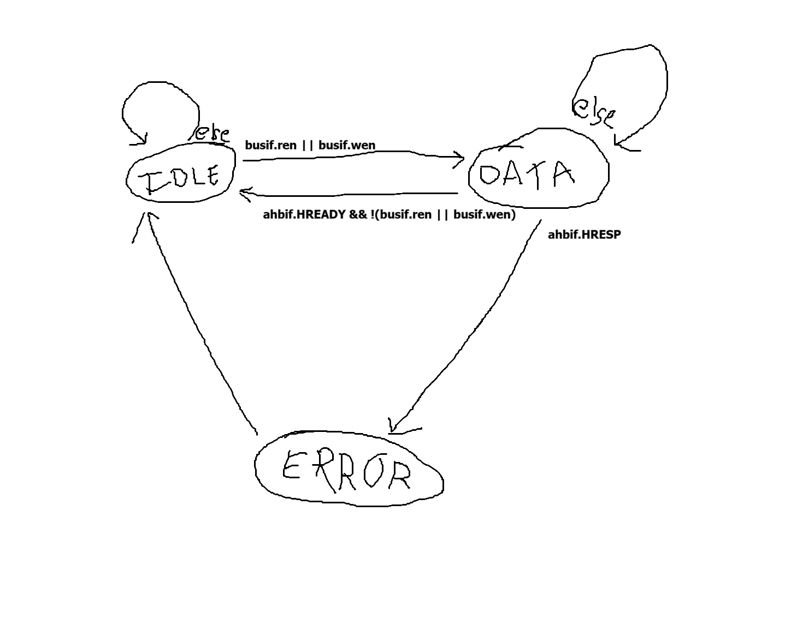
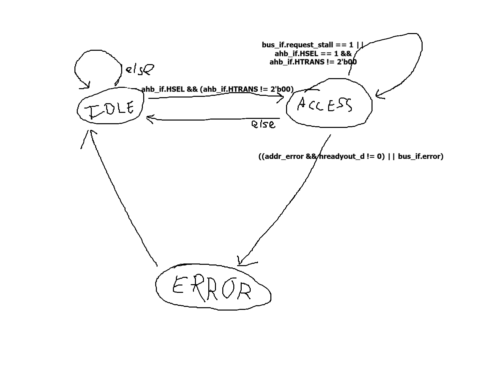
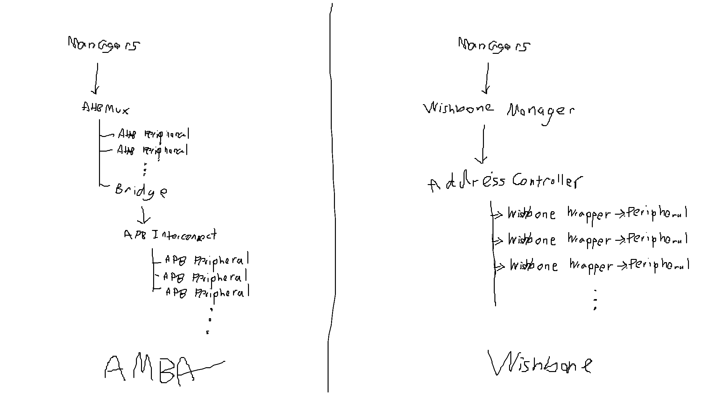

# Wishbone vs AHB/APB
Last Edited : 09/20/2026 by Patchy Suanthong
Including:
- Added a paper summary for “Wishbone Bus Architecture: A Survey and Comparison”
- Studied the top module of the AFT and the original bus-components to better understand how to implement the bus

## Useful documents
- From AFT: https://github.itap.purdue.edu/SoCETOrganization/AFT/blob/main/doc/src/bus_system.md

# top.sv
## Connections
### Bus Interfaces
- bus_protocol_if are used to connect to gpio, memory, clint, uart, timer, etc.
### Bus Interconnects
- Two ahb_if for **managers**
- A bunch of ahb_if for **AHB subordinates/peripherals**
- **muxed_ahb_if**?
- One apb_if for **Requester**, probably handling the bridge output
- A bunch of apb_if for **APB subordinates/peripherals**
### IP
- **ahb_mux**: Takes **managers** and **muxed_ahb_if**
- **ahb_simple_interconnect**: Takes **muxed_ahb_if** and **AHB Peripherals**
- **ahb2apb**: Takes **AHB Peripherals** and **APB Requester**
- **apb_interconnect**: Takes **APB Requester** and **APB Pheripherals**

## Macros
These are the macros mentioned by the professor during Week 4 meeting, which hooks up APB/AHB elements

| Macro | Parameters | Description | Note | 
| ----------- | ------------- | ----------------------------- | ------------------------ | 
| ADD_APB() | module_name  index  nwords  bus_interface | Instantiates an APB Completer at APB_MAP[`index`] with size of `nwords` connected bus interface and apb_peripherals[index] | |
| ADD_AHB() | module_name  index  nwords  bus_interface | Instantiates an AHB Subordinate at AHB_MAP[`index`] with size of `nwords` connected bus interface and ahb_peripherals[index] | |
| DEFINE_INTERRUPT() | irq_name  irq_num  signal | create a 2-stage synchronizer for interrupt outputing to plicif.hw_interrupt_requests[irq_num] || 
| `DEFINE_PIN() | pin_num  functions_to_module  functions_from_module  functions_output_enable | Connection to physical pins | I don't really understand what it does |
| ADD_MULTI_SYNC() | signal_name  width  reset_state  stages  clk  nrst | Instantiate a sync_wrapper to sync multibit data into `sync_<signal_name>` from another clock source | |
| ADD_SYNC() | signal_name  reset_state  stages  clk  nrst | Instantiate a sync_wrapper to sync 1-bit data into `sync_<signal_name>` from another clock source | |

# bus-components
This section provide a summary of the sv files from AHB/APB section, as well as some takeaway
- This section does not contains much about how the bus is integrated into the SoC, for that, look at top.sv
- This section contains details about operation of AHB and APB, and their interfaces.

## bus_protocol_if
| Signal | Width | Direction relative to `protocol` | Meaning / Description |
| ----------------- | -------------: | -------------------------------- | ---------------------------------------------------------------------------------------------------------------------------------------------------------------------------------------------------------- |
| `wen` | 1 | **Output →** | **Write Enable.** Asserted when write transaction. `peripheral_vital` sees this as an input. |
| `ren` | 1 | **Output →** | **Read Enable.** Asserted when read transaction. |
| `request_stall` | 1 | **Input ←** | **Request Stall / Wait Request.** Peripheral asserts when it need to delay the current transaction |
| `addr` | `ADDR_WIDTH` | **Output →** | **Request Address.** An **offset address**, probably relative to the peripheral's base address |
| `error` | 1 | **Input ←** | **Error Response.** Peripheral asserts when transaction failed. |
| `strobe` | `DATA_WIDTH/8` | **Output →** | **Byte Write Enable.** Which bytes of `wdata` to be written.  |
| `wdata` | `DATA_WIDTH` | **Output →** | **Write Data.** Data sent during write. |
| `rdata` | `DATA_WIDTH` | **Input ←** | **Read Data.** Data returned during read. |
| `is_burst` | 1 | **Output →** | **Burst Hint.** The current transfer is part of a burst, not an isolated transfer. |
| `burst_type` | 2 | **Output →** | **Burst Type Hint.** Identifies burst behavior |
| `burst_length` | 8 | **Output →** | **Burst Length Hint.** Number of transfers in the burst |
| `secure_transfer` | 1 | **Output →** | **Security Attribute Hint.** ? |

## ahb_if
Define AHB interface and list of connection logics. 
| Signal | Size | Direction (Manager) | Note | 
| ----------- | -------------: | ----------------------------- | ------------------------ | 
| `HSEL` | 1 | **Output** → | Slave Select | 
| `HREADY` | 1 | **Input** ← | Transfer Ready | 
| `HREADYOUT` | 1 | **Input???** ← | Slave Ready Output | 
| `HWRITE`    | 1 | **Output** → | Write Enable / Direction |
| `HMASTLOCK` | 1 | **Output** →  | Locked Transfer | 
| `HRESP` | 1 | **Input** ← | Transfer Response |
| `HTRANS` | 2 | **Output** → | Transfer Type Identifies `IDLE`, `BUSY`, `NONSEQ`, or `SEQ` |
| `HBURST` | 3 | **Output** → | Burst Type (single/incrementing/wrapping burst) |
| `HSIZE` | 3 | **Output** → | Transfer Size |
| `HADDR` | `ADDR_WIDTH` | **Output** → | Address being accessed. |
| `HWDATA` | `DATA_WIDTH` | **Output** →  | Data to Write | 
| `HRDATA` | `DATA_WIDTH` | **Input** ← | Data to Read |
| `HWSTRB` | `DATA_WIDTH/8` | **Output** → | Which byte lanes of `HWDATA` are being written |

- Has modport sections for manager and subordinate, which is similar to master and slave in Wishbone. 
- A modport defines which logic is input or output for certain logics

## ahb_manager
- has bus_if and ahb_if, probably handle this connection
- always_ff to set the initial state and pass ff for state and dphase.
- always_comb to set the next stage for a state machine

- TODO on HSIZE handling
- always_comb to set values when error
- Handle assigning busif.request_stall busif.rdata busif.error ahbif.HWSTRB ahbif.HWDATA;

## ahb_mux
Multiplexer for path to different AHB slaves

## ahb_simple_interconnect
Connect ahb to multiple subordinates

## ahb_subordinate
- Has FSM

- Has combination logic for assigning logic on **bus** interface based on **current state** and **current address**. Burst logic.
- Has combination logic for assigning logic on **AHB** interface based on **current state** and **current address**. Burst logic.
- Has signal latching logic for request_stall

## apb_if
| Signal | Size | Direction (Manager) | Note |
| --------- | -------------: | ----------------------------- | --------------------------------------------------------------------------------------------------------------------------------------------- |
| `PSEL` | 1 | **Output →** | **Peripheral Select.** Select peripheral/subordinate for transfer |
| `PENABLE` | 1 | **Output →** | **Enable.** access phase = 1, setup phase = 0 |
| `PWRITE` | 1 | **Output →** | **Transfer Direction.** `1` = write, `0` = read. |
| `PREADY` | 1 | **Input ←** | **Ready.** Ready for transfer |
| `PSLVERR` | 1 | **Input ←** | **Slave Error.** peripheral reports a transfer error |
| `PADDR` | `ADDR_WIDTH` | **Output →** | **Address.** Address being accessed. |
| `PWDATA` | `DATA_WIDTH` | **Output →** | **Write Data.** Data sent during a write. |
| `PRDATA` | `DATA_WIDTH` | **Input ←** | **Read Data.** Data returned during a read. |
| `PSTRB` | `DATA_WIDTH/8` | **Output →** | **Write Strobe.** indicating which bytes of `PWDATA` should be written. |
| `PPROT` | 3 | **Output →** | **Protection Attributes.** Provides information about the type/security/privilege |
| `PCLK` | 1 | Clock | **APB Clock.** Clock used by the APB interface. |
| `PRESETn` | 1 | Reset | **Active-low Reset.** Resets the APB logic when `0`. |

# Paper 1
Source: Sharma & Kumar — “Wishbone Bus Architecture: A Survey and Comparison” (2012)
https://arxiv.org/pdf/1205.1860

The following table summarize the key differences between Wishbone and AMBA according to the paper

| Properties | Wishbone | AMBA | Note |
| ---------- | ------------------------------ | ------------------------------ | ------------------- | 
| **Licensing** | Free (Silicore + OpenCores) | Must be Registered (ARM) | |
| **Primary Usage** | Standard and reusable interface between IP Cores in SoC | Standard family of interfaces for connecting components in SoC | |
| **Hierachy** | No Hierachy, same interfaces for the entire system | Hierarchical with High Performance buses and Peripheral buses (_AHB_ -> _Bridge_ -> _APB_) | |
| **Protocol** | One Wishbone Protocol | Multiple Protocols such as AHB and APB | |
| **Master/Slaves** | Support Multiple Master and Slaves | Support Multiple Master and Slaves (APB behind a bridge) | |
| **General Topology** | point-to-point / shared bus / crossbar / dataflow | hierarchical, crossbar/matrix possible through multiple layers of AHB | |
| **Synchronous** | Yes | Yes | |
| **Handshaking** | Yes | Yes | |
| **Data transfer** | Single Read/Write | Read/write transfers | |
| **Burst / block transfer** | Yes | Yes | |
| **RMW (Read Write Modify) Cycle** | Yes | No Dedicated Transfer | |
| **Pipeline Transfer** | Mostly No | Yes | |
| **Split transfers** | No | Yes on AHB | |
| **Bus Width** | 8–64 bits | APB: 8/16/32 bits; AHB/ASB: 32/64/128/256 bits | |
| **Address Width** | 1–64 bits | 32 bits | |
| **Operating frequency** | Defined by User | Defined by User | |
## Notes:
- Wishbone does not have a fixed bus implementation, it's more of a specification, while AMBA is a family of buses.
- Wishbone emphasizes desginer's freedom over standardization
- These means that wishbone implementations on two different SoC can differs a lot.
- To understand how particular bus routes transactions, you need to inspect the ZPU system's HDL
- Paper is quite old (2012)

# KEY TAKEAWAYS
The current architecture isolates most pheripherals from AHB/APB with `bus_protocol_if`. Therefore, implementing Wishbone can occur without chaning peripheral logics.
## Implementation Idea
The key idea is to replace the current  `ahb_if` and `apb_if` interfaces with a single `wishbone_if` interface.

0. Implement `wishbone_if` interface
1. Keep the `bus_protocol_if` facing pheripherals intact (These connects to UART, TIMER, GPIO, etc.)
2. Replace `ahb_manager` with Wishbone manager to deal with incoming signal from CPU
3. Replace `ahb_subordinate` and `apb_completer` with a Wishbone slave wrapper that translate wishbone bus signal to `bus_protocol_if` signals
4. Replace `ahb_mux` with Wishbone arbitration to handle multiple managers/masters
5. Replace `ahb_simple_interconnect` and `apb_interconnect` with and Address Controller, which decode addresses for the wishbone master, select subordinates to connect, and multiplex responses.
6. Remove `ahb2apb` since there is no longer APB
7. Combine AHB_MAP and APB_MAP into one WISHBONE_MAP
8. Make ADD_WISHBONE as a macro
9. Translate Wishbone handshake/error signals to bus_protocol_if wait/error signals.
10. Deal with block/burst transfer if still implemented

The following figures describe the old and new architectures
