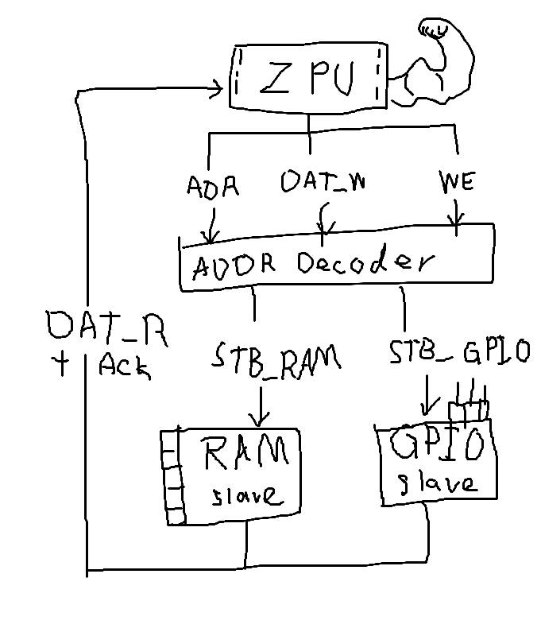

# Wishbone Notes
Last Edited : 09/09/2026 by Patchy Suanthong

Logs:
- Studied the concepts of implementing a wishbone bus in our ZPU SoC (09/09/26)

Sources: 
- https://wishbone-interconnect.readthedocs.io/en/latest/index.html

## Making a Wishbone as a SoCET Student
- For us, we do not have to create logic circuit to implement the bus
- We can use HDL like System Verilog to describe wiring and synthesizing FPGA

### Wishbone Bus Wires
In our ZPU SoC system, there is probably only one master: the ZPU, and a simple master-slave wishbone bus consist of the following wires:
| WISHBONE signal | Size (bits) | Direction | Meaning |
| ---------- | ----------- | --------- | ----------------------------------------------------- |
| `ADR` | 32 | M → S | Address to access (We will design this) |
| `DAT_O` | 32 | M → S | Data to be written |
| `DAT_I` | 32 | S → M | Data to be read |
| `WE` | 1 | M → S | Write-Enable:  `1` write, `0` read |
| `STB` | 1 | M → S | Slave selected flag |
| `CYC` | 1 | M → S | In-progress request signal flag |
| `ACK` | 1 | S → M | Succesful request signal flag |

Note: The sizes were my guesses to fit the ZPU, addresses a0nd data should be 32 bits wide

### Components
Check out this diagram explaining the relationship between each component that facilitates the wishborn bus

1. __ZPU__ : Our Master driving sending the address, data-to-write (if any), and whether to enable WE for write mode
2. __Address Decoder__ : Take the address and see which part of the peripherals/memory that address belongs to, and enable that strobe. We will probablly be making this part as well.
3. __Memory/Peripheral/etc. Slaves__ : Such as a RAM and GPIO. They receive the strobe that enable them, look at WE to see whether to send back data on DAT_R or take in incoming data from DAT_W. Acknowledge that request through ACK.

## Examples
### Example 1: Pseudo Code for Transfering Two Files in One Cycle
~~~
Master:

1. Assert CYC = 1 # Begin Bus Cycle

# Transfer 1
2. Put RAM address on ADR
3. Put WE = 0                  # Read mode, WE = 0
4. Assert STB = 1              # Master STB = Transfer is On

Address Decoder:

5. Which part this ADR correspond to?                 
6. Suppose ADR belongs to RAM
7. RAM_STB = STB = 1           # Enable RAM STB for transfer
8. GPIO_STB = 0
9. UART_STB = 0

RAM Slave:

10. Sees CYC && RAM_STB
11. Performs read
12. Places data on RAM_DAT
13. RAM_ACK = 1

Address Decoder:

14. Routes RAM_DAT back to master DAT_I
15. Routes RAM_ACK back to master ACK

Master:

16. Sees ACK = 1
17. Reads DAT_I
18. Deasserts STB = 0          # Finish first transer

--- Transfer 2 ---

19. Put GPIO address on ADR
20. Put WE = 1                 # Write mode
21. Put value on DAT_O
22. Assert STB = 1             # Another transfer began

Address Decoder:

5. Which part this ADR correspond to?                 
6. Suppose ADR belongs to GPIO
25. RAM_STB  = 0
26. GPIO_STB = STB = 1         # Enable GPIO STB for transfer
27. UART_STB = 0

GPIO Slave:

28. Sees CYC && GPIO_STB
29. Performs write
30. GPIO_ACK = 1

Address Decoder:

31. Routes GPIO_ACK back to master ACK

Master:

32. Sees ACK = 1
33. Deasserts STB = 0
34. Deasserts CYC = 0          # Finish bus cycle
~~~