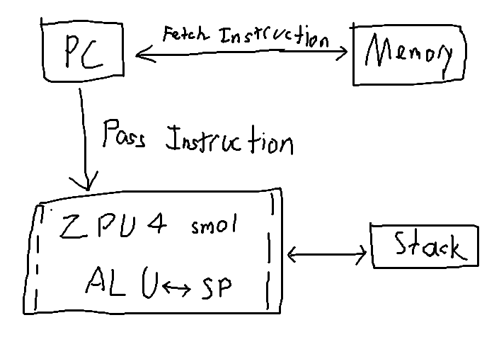

###
# ZPU Datasheet Summary
Last Edited : 09/09/2026 by Patchy Suanthong

Including:
- Summary of important sections (09/09/26)

Original document can be found here: https://github.com/zylin/zpu/blob/master/zpu/docs/zpu_arch.html

## ZPU Architecture
### Stack-Based

 Unlike ARM, RISC-V, or Xx86, ZPU use stack-based architectures instead of register based architecture. The ZPU has one main stack to operate on.

In term of operation, instead of ADD reg1 reg2 reg3, you just said ADD, and it would take the top values of the stack as operand and put result back on top of the stack
~~~
# Stack-Based A DD Example
A = pop()
B = pop()
push(A + B)
~~~ 
Each operation is 32 bits wide (take 32-bit operands) , while the instruction (e.g., ADD) itself is 8 bits wide. This allow for very compact codes.

T
 he atacanconta values, function arguments, temporary results, return addresses, etc.
Literal onstatnts can also be coded into operations using Immediate values (IM) and IDIM flags e.g., 

~~~ 
IM 5
~~~
 

to push 5 to the stack. IM operations can be chained to put larger values.

## Facilitate GCC
The ZPU has its own GCC to enable running register-based codes on stack-based architecture. 

For example, compiling a C script will yield a long list of assembly-like instruction (e.g., ADD r1 r2 r3). ZPU's GCC toolchain is responsbible for transforming these operations into ZPU's opertations, hence there are some operations built into CPU to accomodate frequently used operation. For example, LOADSP n, which load value at address 4*n relative to SP onto the stack, very useful for loading function parameters and variables.

Note: there is also Link-time relaxation, which sink the code even further when addresses of certain things are smaller (thus requiring less IM operation)

## Instruction Set
Each ZPU instruction is 8 bits wide handling different function to handle the stack and perform computation

| Category         | Instructions                                                                |
| ---------------- | --------------------------------------------------------------------------- |
| **Immediate**    | `IM`                                                                        |
| **SP access**    | `LOADSP`, `STORESP`, `ADDSP`, `PUSHSP`, `POPSP`, `PUSHSPADD`                |
| **Memory**       | `LOAD`, `STORE`, `LOADB`, `STOREB`, `LOADH`, `STOREH`                       |
| **Arithmetic**   | `ADD`, `SUB`, `MULT`, `DIV`, `UDIV`, `MOD`, `UMOD`, `NEG`                   |
| **Bitwise**      | `AND`, `OR`, `XOR`, `NOT`, `FLIP`                                           |
| **Shifts**       | `LSHIFTLEFT`, `LSHIFTRIGHT`, `ASHIFTLEFT`, `ASHIFTRIGHT`                    |
| **Comparison**   | `EQ`, `NEQ`, `LESSTHAN`, `LESSTHANOREQUAL`, `ULESSTHAN`, `ULESSTHANOREQUAL` |
| **Control flow** | `POPPC`, `POPPCREL`, `CALL`, `CALLPCREL`, `EQBRANCH`, `NEQBRANCH`           |
| **Special**      | `BREAKPOINT`, `NOP`, `EMULATE`, `PUSHPC`                                  |

Note that although most of these instructions are handled on the hardware-side, some of these are emulated in either RTL or Software microcode. (EMULATE Instruction).
ore Hardaware Instructions = Heavy CPU = Faster Execution
Less Hardware Instructions = Lightweight CPU = More Instructions in Microcode = Slower
## Program Counter and Jump Vectors

| Address  | Purpose                       |
| -------- | ----------------------------- |
| `0x000`  | Reset vector                  |
| `0x020`  | Interrupt vector              |
| `0x040+` | Emulated instruction handlers |

Like most architecture, the Program Counter (PC) stores the address of the next instruction to execute. The PC will be set to these addresses after corresponding events occur.

For examplee, when you hit the reset button, the PC will be set to 0x000. The code at 0x000 is essentially the first line of code that will be run when a program start/reset.

The emulated instruction handlers vector region store the addresses of function handling instruction that are unavailable on hardware. The vector point to a software will handle the instruction like an interrupt would.

## Interrupts

nterrupt is when therunnrng code i is halted to process an interrupting fucition, usually called the "Interrupt Service Routine (ISR
When an interrupt happens, the current state of the CPU is pushed onto a memory stack, which the CPU will return to after it complete the ISR.
Onterrupts are essential to Microcontrollers because they allow something similar to multicore processsing.
### Interrupts in ZPU

For ZPU, its Interrupt Controller is not built into the ZPU

 - External Software Log must handle ISR selection by determining the source itself. This code is enterred though 0x20.  -
- he controller mask which interrupts to enable

## ZPU4 Small
This section contains the HDL implementation using minimal FPGA, I recommend studying it from the raw datasheet, but I will summarize it
ZPU4 Small consists of mainly two parts: 
1. 
Stack-Based CP: Handle a small 3 states FSM 
2. a Small FPGA C : Contain minimum amount of instructions directly implemneted in RTLoe

### The CPU

ZPU4 avoid unnecessary hardware instructions and implement missing ones using EMULATE. This makes the FPGA much smaller and easier to produce.

Here are the 3 states shown in the diagram

1.  __Fetch__ - The processor obtain instruction indicated on the Program Counter (PC), which stores the memory address.  This essentially take 2 cylces, one to request, and one to receive the instruction.

2. __Decode__ - The processor determines what that instruction means, this determine the appropriate hardware instructions.
3. __Execute__ - Processor perform that operation, usually involving the stack.    

Note: ZPU4 Small employs a Dual-Port Ram: It can be accessed from both the Instruction side and Stack side.

## ZPU4 Medium
he following table compare the difference s between ZPU4 Small and Medium implementations. (Table by ChatGPT)

|                       | **ZPU4 Small**            | **ZPU4 Medium**                        |
| --------------------- | ------------------------- | -------------------------------------- |
| Primary goal          | Minimum size / simplicity | Better performance                     |
| Hardware instructions | Fewer                     | More                                   |
| Software emulation    | More important            | Less needed                            |
| Memory arrangement    | Dual-port RAM oriented    | Single-port memory interface           |
| Memory carries        | Code/data                 | Code/data/I/O through common interface |
| Control               | Simple FSM                | More capable implementation            |
| FPGA resources        | Smaller                   | Larger                                 |
| Performance           | Lower                     | Higher                                 |

Source: https://chatgpt.com/
## Implementing Your Own ZPU
Probably the most interesting part of this datasheet. You don not have to understand the toolchain in detail, only HDL and standard GCC usage.

The steps are as follow, more details can be found in the original: 

1. Focus on implement behaviors of each instruction

2. Generate instruction traces using zpu_core.vhd or zpu_core_small.vhd to check your implementation..
3. Make optional instructions with EMULATE.
4. Use DMIPS test to measure overall performance.
5. Use histogram.perl script to generate a histogram of how frequent each instructions are used, very useful for optimization.

## Memory Architecture
The ZPU is very independent of the surrounding memory system
### Memory-Mapped I/O
The ZPU use MM I/O to connect to peripherals, which allow the processor to access the peripherals valus and configurations using memeory addresses

Fire Load/Store Operation, Fire Address, Take aOut or Put In data at RAM or Peripherals.

The ZPU does not edefine its own memory map, but there is a memory mapping often referred to, which is the on used by GCC + libgloss + ecos. The map can be used as a reference when designing our ZPU. This table is under "Phi Memory Map" in the data sheet.
| Address      | Access | Register / Function         | Description                                                        |
| ------------ | :----: | --------------------------- | ------------------------------------------------------------------ |
| `0x080A0000` | **RW** | **ZPU Enable**              | Bit 0: `0` = idle, `1` = running                                   |
| `0x080A0004` | **RW** | **GPIO Data**               | GPIO data register                                                 |
| `0x080A0008` | **RW** | **GPIO Direction**          | GPIO direction: `0` = output, `1` = input                          |
| `0x080A000C` | **RW** | **UART TX**                 | Bit 8 = TX ready; bits `[7:0]` = transmit byte                     |
| `0x080A0010` |  **R** | **UART RX**                 | Bit 8 = RX valid; bits `[7:0]` = received byte                     |
| `0x080A0014` | **RW** | **Counter Low**             | Low counter value; Bible also describes reset/sample behavior      |
| `0x080A0018` |  **R** | **Counter High**            | High counter value                                                 |
| `0x080A0020` | **RW** | **Global Interrupt Mask**   | `0` = interrupts enabled, `1` = interrupts disabled                |
| `0x080A0024` | **RW** | **UART Interrupt Enable**   | Enables/disables UART interrupt                                    |
| `0x080A0028` | **RW** | **UART Interrupt Pending**  | Read pending status / write to clear                               |
| `0x080A002C` | **RW** | **Timer Interrupt Enable**  | Enables/disables timer interrupt                                   |
| `0x080A0030` | **RW** | **Timer Interrupt Pending** | Pending status / reset / clear                                     |
| `0x080A0034` | **RW** | **Timer Period**            | Timer counts **down** from period to `0`, then generates interrupt |
| `0x080A0038` |  **R** | **Timer Counter**           | Current timer counter value                                        |

Note that some of these are not readable, some are not writable, check the access column.
# Wishbone Bridge
The ZPU datasheet did not go into detail on Wishbone, but some ref design implements it, such as an SoC. 

The implemeationnt can be found in hdl/wishbone of the ZPU repository (.vhd files), but it is only designed to work on ZY2000.

#